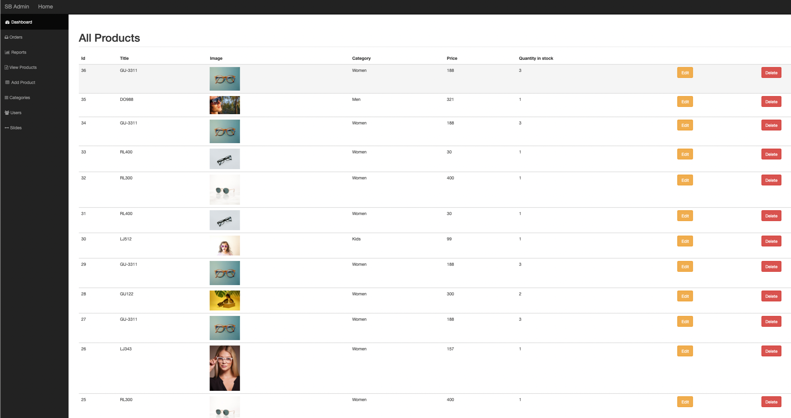
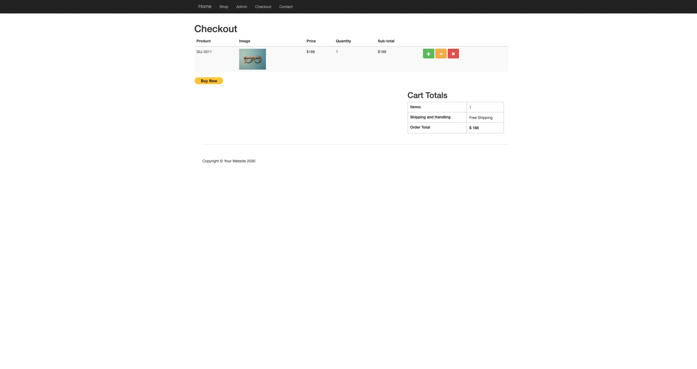
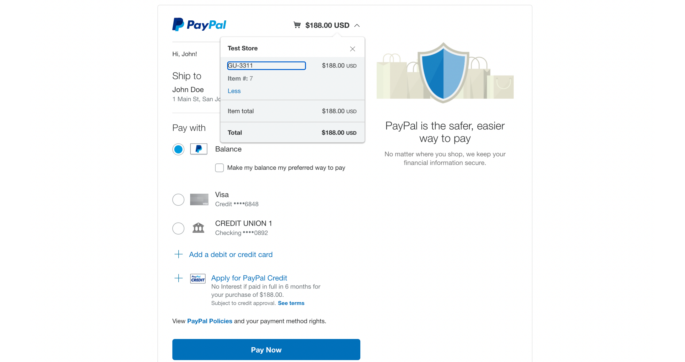

# Basic PHP Ecommerce Store with PayPal integration
> Ecommerce site based on the cource "PHP for Beginners: How to Build an Ecommerce Store" 
> Cource can be found [_here_](https://www.udemy.com/course/php-for-beginners-how-to-build-an-ecommerce-store/).

## Table of Contents
* [General Info](#general-information)
* [Technologies Used](#technologies-used)
* [Features](#features)
* [Screenshots](#screenshots)
* [Setup](#setup)
* [Project Status](#project-status)
* [Contact](#contact)
<!-- * [License](#license) -->

## General Information
- The purpose of the project is to master procedural PHP. 

## Technologies Used
- PHP - [version 7](https://www.php.net/)
- Bootstrap - [version 3.3.4](http://getbootstrap.com)
- Jquery - [version 1.11.1](https://code.jquery.com/)
- MySQL DB

## Features
- PayPal - [Developer PayPal](https://developer.paypal.com/home)

## Screenshots

## Setup for local environment
- Install [PHP 7.*](https://www.php.net/)
- Used development environment [XAMPP](https://www.apachefriends.org/index.html)

## Project Status
Project is: _finished_

## Contact
Created by [@Lilyana Vankova](https://github.com/Lilyah) - feel free to contact me!

<!-- Optional -->
<!-- ## License -->
<!-- This project is open source and available under the [... License](). -->

<!-- You don't have to include all sections - just the one's relevant to your project -->
